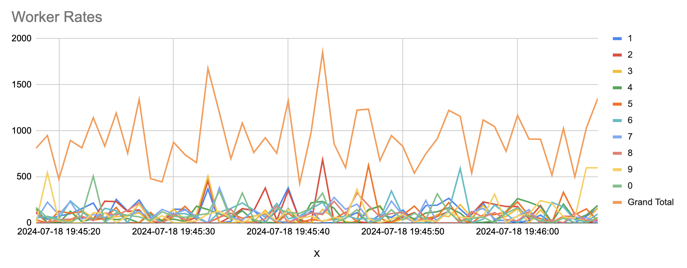
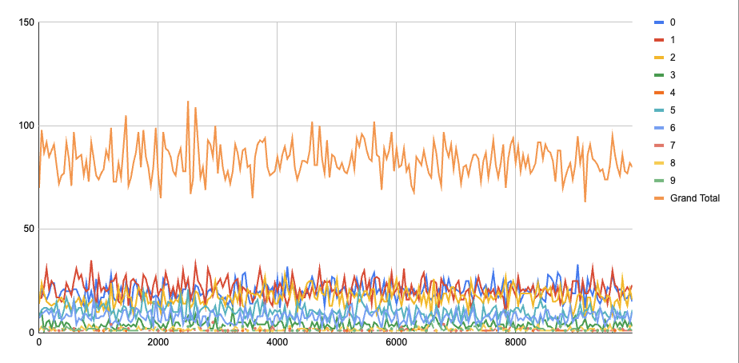
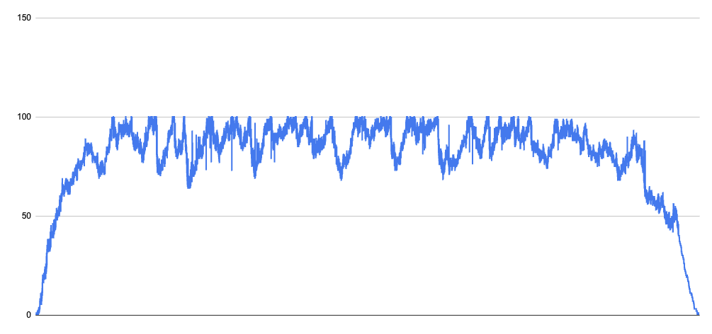
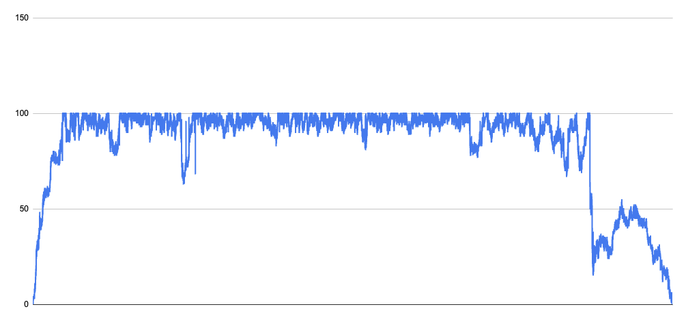

# AIMD - Additive increase/multiplicative decrease
AIMD is a congestion control algorithm used in TCP.
It is a simple algorithm that increases the congestion window size by 1 MSS (Maximum Segment Size) every RTT (Round Trip Time) until a packet loss is detected.
When a packet loss is detected, the congestion window size is halved.
The congestion window size is then increased by 1 MSS every RTT until another packet loss is detected.
This process is repeated until the congestion window size reaches the maximum value.

See https://en.wikipedia.org/wiki/Additive_increase/multiplicative_decrease

## Simulation
The example directory contains a simulation of multiple concurrent workers along with a CSV of a run using the default parameters.
Each worker has its own limiter and attempts to run a number of concurrent operations.

### Run 1
The following chart shows the maximum concurrency limit of each worker on a 1 second interval.
The simulation was run with 10 workers each with a concurrency of 1,000 each for 10,000 iterations per concurrent operation.
The underlying resource has a concurrency of 1,000.

### Run 2
The following chart shows the maximum concurrency limit of each worker (i.e. client).
The simulation was run with 10 workers each with a concurrency of 100 each for 100 iterations per concurrent operation.
The underlying resource has a concurrency of 100.

The following chart shows the client's utilization of the server.
The values don't perfectly match the server's utilization due to the grouping used for client utilization values.

The following chart shows the server's utilization.

### Run 2
The following chart shows the maximum concurrency limit of each worker (i.e. client).
The simulation was run with 10 workers each with a concurrency of 100 each for 100 iterations per concurrent operation.
The underlying resource has a concurrency of 100.
The limiter's were incremented only when they were not denied access by the server in RTT window.

The following chart shows the server's utilization.

## Acknowledgement
This code is based a fork of [golang.org/x/sync/semaphore#Weighted](https://pkg.go.dev/golang.org/x/sync@v0.7.0/semaphore#Weighted).
All code from the original implementation maintains its original license.
The semaphore implementation is extended to support AIMD.
